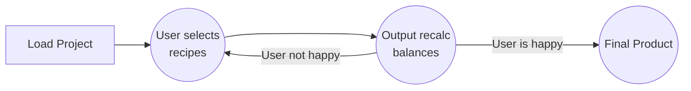

# Factory Planner

Factory planner is a tool for playing the game Satisfactory+ - an automation and base-building game. It solves the challenge of planning a complex factory with several production stages and machines.

A list of ~250 game-recipes affecting ~400 ingredients is pre-populated from which a user makes selections to edit the resulting output and check the balance of intermediate products. 

Essentially, the program is a product sum calculating data grids with dynamic column row filtering based on the users needs. 

This is a conceptually simple problem; but the number of recipes, combinations of inputs, alternate recipe pathways, biproduct-handling and in-game time-to-build  concerns of the game create complexity that justifies the need for a planning tool.

## Features

 - automatic filtering for ingredients based on recipe search
 - machine-lookup to find recipes
 - conditional formatting for glancing 

## Implementation

 - Satisfactory Planner is implemented in a c# winforms application
   using MVVM architecture.  
 - The recipe table, and headings for user
   selections  results are loaded upon startup from a csv file
   configured in the app.config file. 
 - This application was authored from the C# winforms application template in visual studio using only my own knowledge & ability to research documentation; this is my own work and not a reskin of another online tutorial. 
 - It's essentially a selfish project because I wanted this thing to exist for my own amusement.

## Getting started

The general use of this is imagined to be iterative like this.

## Credits & Acknowledgements

I did not write the recipe tables or otherwise any gameplay ideas copied into this app. 
This app is not affiliated with these ideas.

Credit for these ideas and work belongs to Coffee Stain and KYR.ium Mods. These creators can be supported via links 

Official K-Mods discord: [KMods Discord](https://discord.gg/JsJ9XXWS7Q)

Official Satisfactory discord: [Satisfactory  Discord](https://discord.com/invite/satisfactory)
 

<!--stackedit_data:
eyJoaXN0b3J5IjpbNDM5MzgwMjE0LC01OTA1MDIwMDAsLTI3Nz
Q0NTgwLC0xMjI1MjMzNjQsNTEwMjM3NzY2LDIwMjI5ODMxMTQs
LTQzNTIwNTUwMSwxMDM2NjI2NzIyLC02MjAyMTY3OTUsLTMzMz
g2OTY4MV19
-->